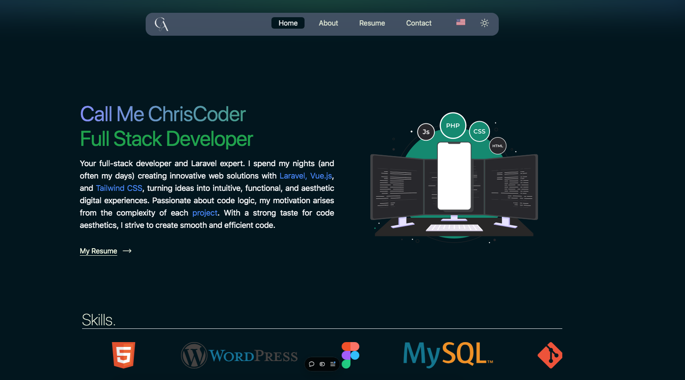

# 🌐 Code with Chris - Portfolio


Bienvenue sur mon portfolio développé avec **Vue.js** !  
Ce projet met en avant mes compétences, expériences, et réalisations en tant que développeur web full-stack.

---


## Aperçu du Site en Dark Mode 


---

## 🌟 Fonctionnalités

- **Technologies modernes :** Construit avec **Vue.js** pour une interface réactive et performante.  
- **Contact simplifié :** Intégration de l'API **EmailJS** pour permettre aux visiteurs de m'envoyer des messages directement via le formulaire de contact.  
- **Responsivité :** Adapté à tous les écrans (mobile, tablette et desktop).  
- **Design épuré :** Interface moderne et élégante, mettant en valeur mes projets et compétences.  
- **Multilingue :** Support des langues **français** et **anglais** avec i18n.

---

## 🚀 Technologies utilisées

- **Framework Frontend :** [Vue.js](https://vuejs.org/)  
- **API de messagerie :** [EmailJS](https://www.emailjs.com/)  
- **Gestion des styles :** [Tailwind CSS](https://tailwindcss.com/) et [DaisyUI](https://daisyui.com/)  
- **Internationalisation :** Gestion multilingue avec i18n.

---

## 📂 Structure du projet

```
├── public/
│   ├── images/         # Images statiques utilisées dans le site
│   └── favicon/        # Icônes du site
├── src/
│   ├── assets/         # Images et ressources de styles
│   ├── components/     # Composants réutilisables
│   ├── locales/        # Fichiers JSON pour les traductions (français et anglais)
│   ├── views/          # Pages principales (Home, About, Contact, etc.)
│   └── App.vue         # Composant racine
└── package.json        # Configuration des dépendances
```

---

## 📋 Installation et exécution

1. **Cloner le projet :**
   ```bash
   git clone https://github.com/RootCode2024/portfolio.git
   cd portfolio
   ```

2. **Installer les dépendances :**
   ```bash
   npm install
   ```

3. **Lancer le serveur de développement :**
   ```bash
   npm run dev
   ```

4. **Accéder au site :**  
   Ouvrez votre navigateur à l'adresse [http://localhost:5173](http://localhost:5173).

---

## 📨 Configuration d'EmailJS

1. Créez un compte sur [EmailJS](https://www.emailjs.com/).  
2. Configurez un **service email**, un **modèle** et récupérez votre `SERVICE_ID`, `TEMPLATE_ID` et `USER_ID`.  
3. Ajoutez-les dans votre fichier `.env` :
   ```env
   VITE_EMAILJS_SERVICE_ID=your_service_id
   VITE_EMAILJS_TEMPLATE_ID=your_template_id
   VITE_EMAILJS_USER_ID=your_user_id
   ```

---

## 📬 Me contacter

Envoyez-moi un message via le formulaire de contact ou par email :  
- **E-mail :** chrislainavocegan24@gmail.com  
- **LinkedIn :** [Chrislain Avocegan](https://www.linkedin.com/in/chrislain-avocegan-314273315)  
- **Portfolio en ligne :** [ChrislainAvocegan.site](https://chrislainavocegan.site)

---

## 📄 Licence

Ce projet est sous licence **MIT**. Vous pouvez librement l'utiliser, le modifier, ou l'améliorer.  

---

### ✨ Développé avec passion par *Code with Chris*  
